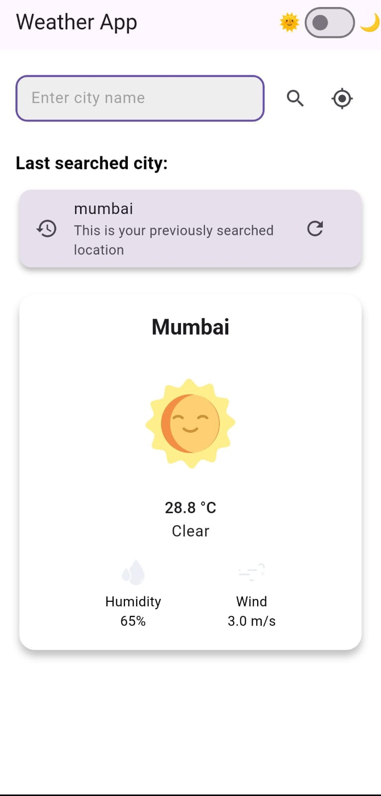

# 🌤️ WeatherApp

A simple Flutter weather application that fetches real-time weather information based on the city or user's current location using device geolocation.

---

## 🚀 Setup Instructions

1. **Clone the repository**  
   git clone https://github.com/RamShekade/WeatherApp.git
   cd WeatherApp
Install dependencies

flutter pub get

Set up launcher icon (optional)
Make sure you have the flutter_launcher_icons dependency, then run:
dart run flutter_launcher_icons

Run the app

flutter run
📱 Features
🌍 Fetch weather by city name or by current location.

📍 Uses geolocator to get user’s location.

💾 Stores last searched city using shared_preferences.

📶 Handles no internet and location permission exceptions.

🧠 Approach
The app uses WeatherProvider as a ChangeNotifier for state management.

Weather data is fetched using WeatherService via HTTP API calls.

Local storage is handled via shared_preferences to save and load the last searched city.

Internet connectivity errors are gracefully caught and shown to the user.

Location permission is handled dynamically with proper error messages.

📸 Screenshots

A few resources to get you started if this is your first Flutter project:

- [Lab: Write your first Flutter app](https://docs.flutter.dev/get-started/codelab)
- [Cookbook: Useful Flutter samples](https://docs.flutter.dev/cookbook)

For help getting started with Flutter development, view the
[online documentation](https://docs.flutter.dev/), which offers tutorials,
samples, guidance on mobile development, and a full API reference.
